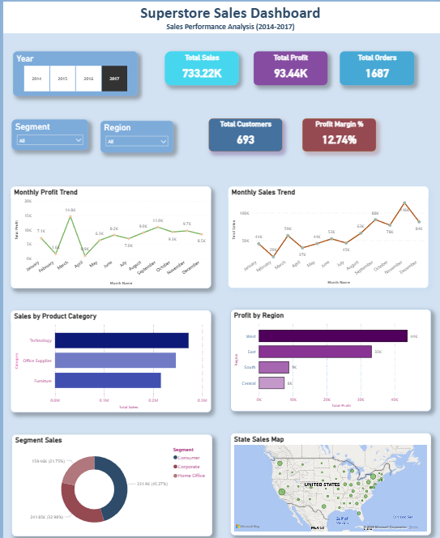
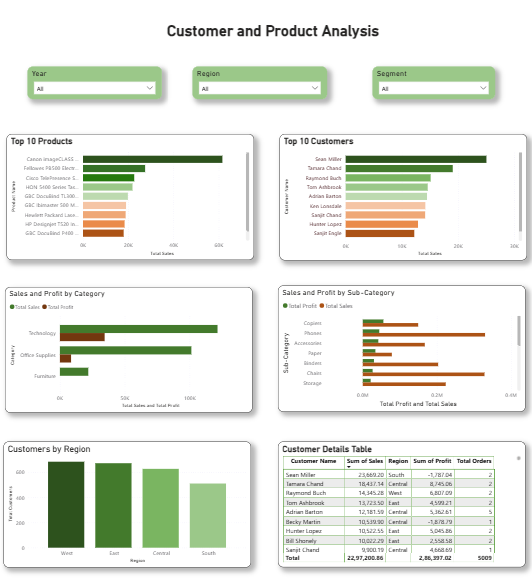
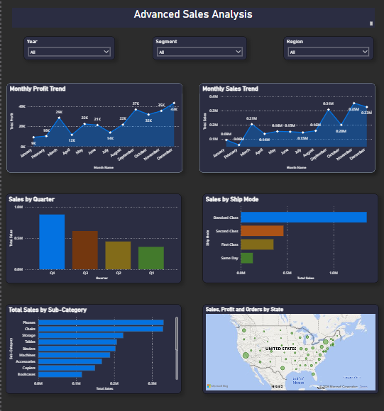

# 📊 Sales & Revenue Dashboard

<p align="center">


</p>

An interactive **Power BI dashboard** developed using the **Sample Superstore** dataset to analyze **sales performance, profitability, customer behavior, and product performance**.

This project demonstrates end-to-end Business Intelligence development, including **data cleaning, data modeling, DAX calculations, KPI design, and interactive dashboard creation**.

---

## 📑 Table of Contents

- [Project Overview](#-project-overview)
- [Business Problem](#-business-problem)
- [Project Objectives](#-project-objectives)
- [Dashboard Pages](#-dashboard-pages)
- [Technologies Used](#-technologies-used)
- [Dataset](#-dataset)
- [Key Performance Indicators](#-key-performance-indicators)
- [Business Insights](#-business-insights)
- [Repository Structure](#-repository-structure)
- [How to Use](#-how-to-use)
- [Skills Demonstrated](#-skills-demonstrated)
- [Future Improvements](#-future-improvements)
- [Author](#-author)

- ---

# 📌 Project Overview

The **Sales & Revenue Dashboard** is an interactive Business Intelligence solution built in **Microsoft Power BI** using the **Sample Superstore** dataset.

The dashboard enables business users to monitor key performance indicators (KPIs), analyze sales trends, evaluate customer purchasing behavior, and identify product performance across different regions and market segments.

The report is designed to support data-driven decision-making through interactive visualizations, filters, and drill-down analysis.

---

# 🎯 Business Problem

Businesses generate large volumes of sales data, but raw data alone does not provide actionable insights. Decision-makers need a centralized dashboard that allows them to quickly understand:

- Overall business performance
- Sales and profit trends
- Customer purchasing behavior
- Product performance
- Regional sales distribution
- Operational performance

This project transforms raw transactional data into meaningful business insights through interactive dashboards.

---

# 🎯 Project Objectives

The primary objectives of this dashboard are:

- Monitor overall sales and profitability
- Track monthly sales and profit trends
- Analyze customer purchasing behavior
- Identify top-performing products
- Evaluate regional and state-wise performance
- Compare product categories and sub-categories
- Support business decisions using interactive visualizations

- ---

# 📊 Dashboard Pages

## 1️⃣ Executive Dashboard

Provides an overview of business performance through key performance indicators including sales, profit, orders, customers, monthly trends, category analysis, regional performance, and geographic sales distribution.



---

## 2️⃣ Customer & Product Analysis

Analyzes customer purchasing patterns, product performance, top customers, top-selling products, and category-level profitability.


---

## 3️⃣ Advanced Sales Analysis

Provides deeper operational insights including quarterly sales trends, ship mode analysis, state-level performance, monthly trends, and sub-category analysis.



---

# 🛠️ Technologies Used

| Category | Technologies |
|----------|--------------|
| Business Intelligence | Microsoft Power BI |
| Data Preparation | Power Query |
| Data Modeling | Star Schema |
| Calculations | DAX (Data Analysis Expressions) |
| Data Source | Sample Superstore Dataset |
| Data Visualization | Interactive Charts, Maps, KPIs, Tables |
| Version Control | Git & GitHub |

---

# 📂 Dataset

**Dataset:** Sample Superstore

The dataset contains transactional sales records, including:

- Order Details
- Customer Information
- Product Categories
- Sales
- Profit
- Quantity
- Discounts
- Geographic Information
- Shipping Details

The data was transformed and modeled using **Power Query** before being analyzed in Power BI.

---

# 📈 Key Performance Indicators

The Executive Dashboard highlights the following KPIs:

- 💰 Total Sales
- 📈 Total Profit
- 📦 Total Orders
- 👥 Total Customers
- 📊 Profit Margin
- 📅 Monthly Sales Trend
- 📅 Monthly Profit Trend
- 🌍 Regional Sales Performance
- 🗺️ State-wise Sales Distribution

- ---

# 💡 Business Insights

The dashboard enables stakeholders to:

- Identify the most profitable products and categories.
- Monitor monthly sales and profit trends.
- Compare regional and state-level business performance.
- Analyze customer purchasing behavior.
- Evaluate product performance across categories and sub-categories.
- Identify top customers contributing to revenue.
- Support strategic business decisions using interactive visualizations.

- ---

# 📁 Repository Structure

```text
sales-revenue-dashboard
│
├── Dashboard for Sales and Revenue.pbix
├── Dashboard for Sales and Revenue.pbit
├── Dashboard for Sales and Revenue.pdf
├── Sample - Superstore.csv
├── Theme.json
├── Executive_Dashboard.png
├── Customer_Product_Analysis.png
├── Advanced_Analysis.png
├── LICENSE
├── README.md
└── .gitignore
```
---

# 🚀 How to Use

1. Clone or download this repository.
2. Open `Dashboard for Sales and Revenue.pbix` using Microsoft Power BI Desktop.
3. Refresh the data if required.
4. Explore the interactive dashboard using slicers and filters.

---

# 💼 Skills Demonstrated

- Microsoft Power BI
- Data Cleaning using Power Query
- Data Modeling
- DAX Measures
- KPI Development
- Interactive Dashboard Design
- Data Visualization
- Business Intelligence Reporting
- Business Performance Analysis
- Git & GitHub Version Control

- ---

# 🔮 Future Improvements

- Add Row-Level Security (RLS)
- Publish the report to Power BI Service
- Implement incremental data refresh
- Add forecasting and trend analysis
- Optimize dashboard performance for large datasets
- Create a mobile-friendly report layout

---

# 👩‍💻 Author

**Sariga Sudarsanan**

Aspiring Data Analyst passionate about Business Intelligence, Data Analytics, and Data Visualization.

- **GitHub:** https://github.com/Sariga98
- **LinkedIn:** https://www.linkedin.com/in/sariga-sudarsanan-79481118b

---

## ⭐ If you found this project helpful, consider giving it a star!
